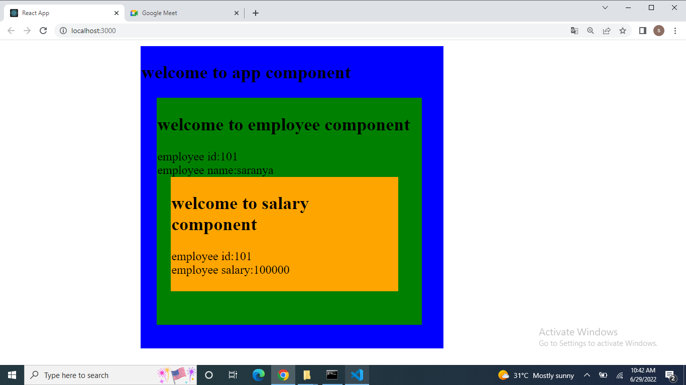

USECONTEXT IN REACT JS:

1.In react js useContext() is used to avoid the prop drilling.
context is used to pass data from nested level component without using props.
2.Three steps for use context;
       1.creating context
       2.creating provider
       3.consuming(useContext)

3.you can pass the data from parenet to child component we use prop(stands for property,it is an object).

4.props transfer data in one-way flow(only from parent ot child component).it is not possible to pass daa from child to parent.

1.create the app component(it is an root component)
App.js

import React from 'react';
import Employee from '../Employee/Employee';
import './App.css';

//creating the context.in this context we have an provider and consumer.
export const employeeContext = React.createContext();

//creating an employee variable and pass the object.this object is accessable in all nested component by using createContext().
const employee = {
    id: 101,
    name: "saranya",
    location: "namakkal",
    salary: 100000
};
function App() {

    return (
        

            <h2>welcome to app component</h2>
     //every context object comes with provider.provider is created in root level component(that is App component)
     //provider has an value property.in which data is pass in an value it is accessable in all the component within the provider.       
            <employeeContext.Provider value={employee}>
            //now we will call Employee component from App component.
                <Employee></Employee>
            </employeeContext.Provider>
        

    );
}
//App component is render in index.js.
export default App;

2.creating Employee component.
Employee.js

import { useContext } from "react";
import { employeeContext } from "../App/App";
import Salary from "../Salary/Salary";
import './Employee.css'

function Employee() {
    //you can access employeeContext hear using useContex hooks.
    //in useContext hooks we will pass the employeeContext.using this context you can access employee data from Employee component.
    let context = useContext(employeeContext);

    return (
        

            <h2>welcome to employee component</h2>
            //display employee detail in Employee component.
            employee id:{context.id  
            employee name:{context.name}  
            <Salary></Salary>
        

    );
}

export default Employee;

3.create salary component.
Salary.js

import { useContext } from "react";
import { employeeContext } from "../App/App";
import './Salary.css'

function Salary() {
    //you can access employeeContext hear using useContex hooks.
    //in useContext hooks we will pass the employeeContext.using this context you can access employee data from Salary component.
    let context = useContext(employeeContext)
    return (
        

            <h2>welcome to salary component</h2>
            //display employee detail from salary component
            employee id:{context.id}  
            employee salary:{context.salary}

        

    );
}

export default Salary;

Screenshot:

